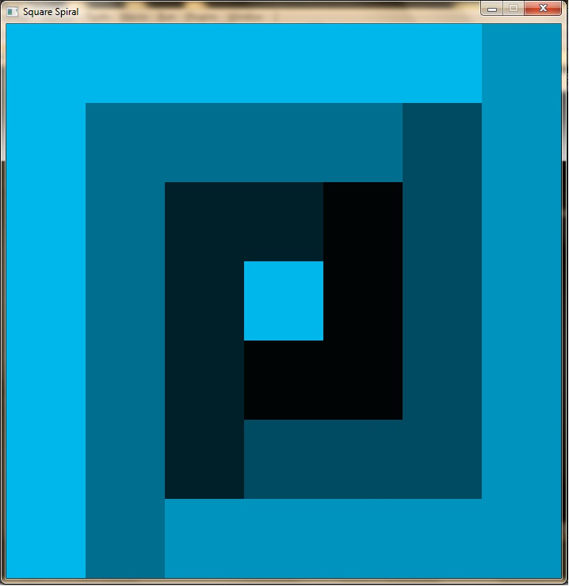

# Square Spiral

Inspired by Archimedes spiral. Achieved by traversing the 7x7 grid and coloring
it using different shade of cyan. 
  

## Requirement

To run this, an installation of CSFML, the C binding for the SFML graphics library.
  

## Note

When building it, just ignore the deprecation warning for CSFML library.
  

## Screenshot

  

